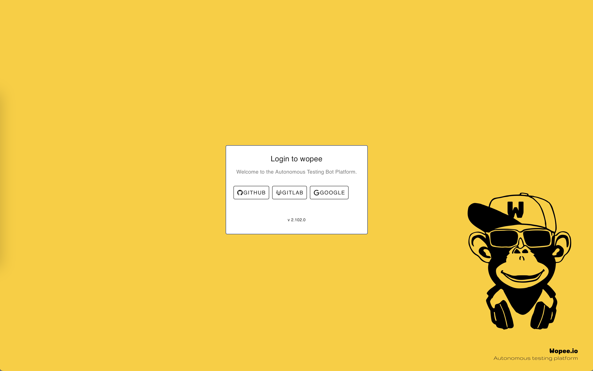
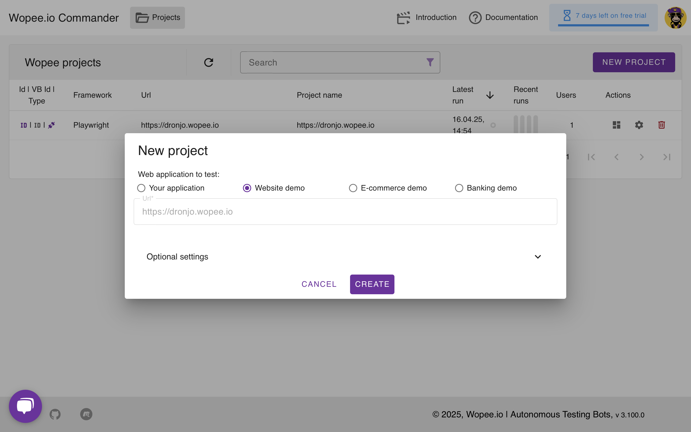
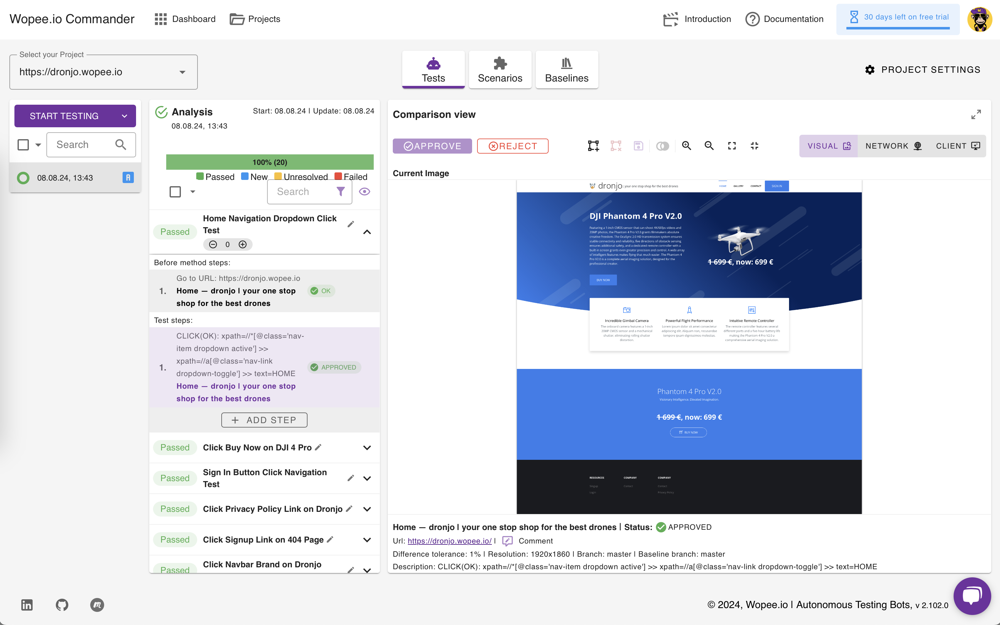
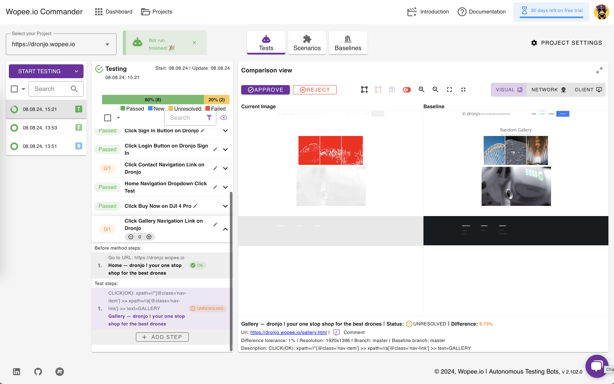

# 🤖 Getting started

## 1. Login to [Wopee Commander](https://cmd.wopee.io)

1. Go to [https://cmd.wopee.io](https://cmd.wopee.io).
2. Click on the `GitHub` or `GitLab` or `Google` login button.
3. Use your existing [GitHub](https://github.com/signup) or [GitLab](https://gitlab.com/users/sign_up) or [Google](https://accounts.google.com/) account and confirm the access.

## 2. Create a project

1. Click the `NEW PROJECT` button in the top right corner.
2. Enter the URL of your app.
3. Confirm by clicking `CREATE`.

## 3. Get your tests

After creating a project, you have two options to add tests:

**A. Generate new tests automatically**

- Start a [NEW ANALYSIS](concepts/analysis-process.md) to let the system create tests for you.
- Learn about [🛠️ Tools & Assertions](concepts/tools-and-assertions.md) to understand how the agent interacts with your app.

**B. Integrate your existing tests**

- Use your own test suites with one of the following frameworks:

  - [Playwright](playwright-visual-testing.md)
  - [Cypress](cypress/01-getting-started.md)
  - [Robot Framework](robot-framework/01-getting-started.md)
  - [WebdriverIO](webdriverio-visual-testing.md)

## 4. Run tests

Once your tests are ready:

1. Click the `START TESTING` button to begin running your tests.

> **Note:** The `START TESTING` button may be disabled if tests are currently running.

## 5. Check the results

1. Visual difference is highlighted if it was identified comapring current state (on the left) and the baseline - previously approved state (on the right).

## 6. Approve current state

You can **👍 Approve** or **👎 Reject** current state of the tested application if [Test Step Status](glossary.md#test-step-status) is:

- `New` - no previous state was approved (for this test step)
- `Unresolved` - previous state was already approved but current state is different (for this test step)
