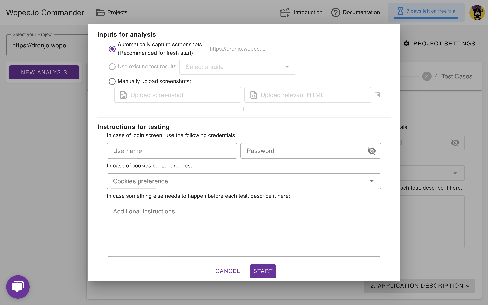

# Analysis Process

The analysis process transforms your application into a set of actionable, automated tests by systematically exploring its features, identifying user journeys, and generating reliable test cases. This ensures your app is thoroughly understood and tested, while giving you full control to guide and refine each step for maximum relevance and coverage.

Below is a step-by-step overview of how your application is analyzed and how you can influence each phase.

## New Analysis

Before starting the analysis, you can tailor how source data is collected and provide specific instructions for the crawler:

**Screenshot Input Options:**

- **Automatically capture screenshots** (recommended for a fresh start): The system explores your app and collects new screenshots and HTML.  
  _The project URL is displayed for confirmation._
- **Use existing test results:** Select a previous test suite to reuse its data (option enabled when suites are available).
- **Manually upload screenshots:** Upload your own screenshots and relevant HTML files for analysis.

**Testing Instructions:**

- **Login Credentials:** Provide a username and password to be used if a login screen appears.
- **Cookies Consent:** Specify your cookies preference for handling consent dialogs.
- **Pre-Test Actions:** Add any additional instructions or steps that should be performed before each test (e.g., setup actions, navigation, or configuration).

Once you’ve configured these options, you can start the analysis or cancel to return to the previous screen.

## 1. Collecting Input Data

**What Happens:**

- ✅ **Automated Exploration:** The AI interacts with your app via the provided URL, following your instructions and using any credentials you supply.
- 📸 **Data Capture:** Screenshots and HTML are collected after each interaction step.

**Duration:** 5–15 minutes (or ~1 minute if using previous results or manual uploads)

**Why it matters:**  
Accurate data collection ensures targeted and reliable testing.

**Your Options:**

- ⚡ **Reuse Results:** Use data from previous test runs to speed up analysis.
- 📤 **Manual Upload:** Upload your own screenshots and HTML for immediate analysis.

## 2. Analyzing Collected Data

**What Happens:**

- 🔍 **Automated Analysis:** The system examines screenshots and HTML to detect features and areas of interest.
- 📝 **Document Generation:** A structured document is created, summarizing key areas for testing.

**Duration:** 1–2 minutes

**Why it matters:**  
A clear, well-structured document leads to precise and effective test coverage.

**Your Actions:**

- ✏️ **Edit Document:** Refine, expand, or clarify the generated document as needed.
- 🔄 **Regenerate Document:** Restart the analysis to incorporate new instructions or reset changes.

## 3. Identifying User Journeys

**What Happens:**

- 🗺️ **Scenario Detection:** Realistic user journeys are identified based on your app’s structure.
- 📖 **User Story Generation:** Scenarios are written as user stories:  
  _As a [role], I want to [action], so I can [goal]._

**Duration:** 1–2 minutes

**Why it matters:**  
Relevant user stories ensure meaningful and comprehensive test coverage.

**Your Actions:**

- ✏️ **Edit Stories:** Adjust roles, actions, or goals, or add/remove stories as needed.
- 🔄 **Regenerate Stories:** Generate new stories based on your updated instructions.

## 4. Creating Test Cases

**What Happens:**

- 🚦 **Test Generation:** Each user story is converted into executable test cases, including detailed steps and element locators.
- 🛠️ **Test Automation:** Choose between:
  - **Direct Mode:** Fast code generation without live execution (10–30 seconds per test).
  - **Agent Mode:** An interactive AI performs the scenario live for highly reliable code (5–10 minutes per test).

**Duration:** Varies by mode and number of scenarios

**Why it matters:**  
Well-structured tests lead to dependable and actionable results.

**Your Actions:**

- ✏️ **View/Edit:** Inspect and adjust test details, steps, or generated code.
- ✨ **Generate Code:** Create executable tests in your preferred mode.
- ▶️ **Run Tests:** Execute tests immediately to validate functionality.
- 💾 **Save to Git:** Store finalized scenarios and code in your connected Git repository.
- ➕ **Add New:** Create additional user stories or test cases as needed.
- 🔄 **Regenerate:** Refresh scenarios or code based on new instructions.