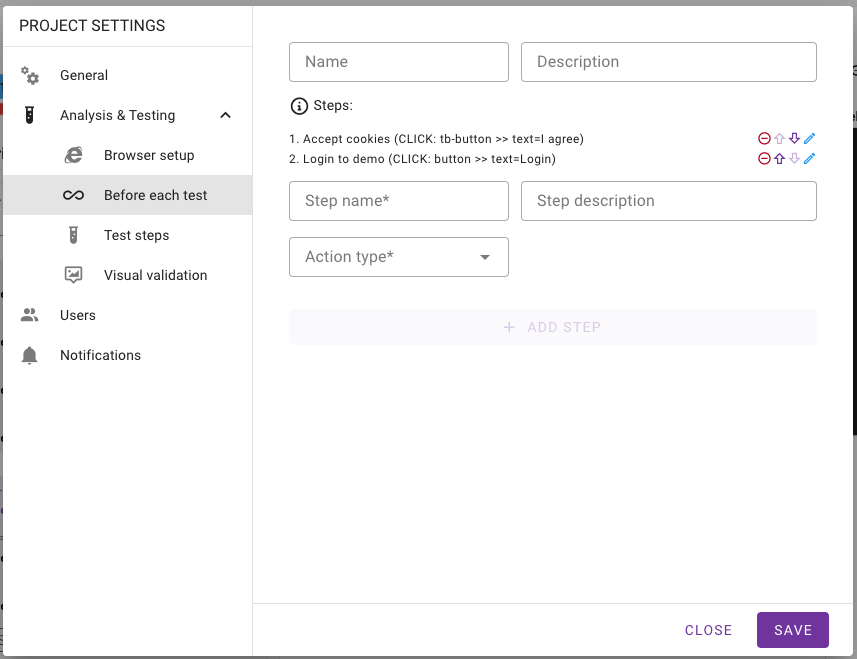

# Before Method

To ensure consistent test execution, you can configure actions that run before each test. This is particularly useful for user authentication, cookie management, and other preparatory steps.

## Step 1: Navigate to Project Settings

1. Go to the [Wopee.io Commander](https://cmd.wopee.io).
2. Select your project and click on **Project Settings**.
3. Navigate to **Analysis & Testing > Before each test**.

## Step 2: Add Pre-Test Steps

Under **Before each test**, fill in the form and then click **Add Step** to define actions that will execute before every test in the project.

Available **Action Types** include:

- **Click**: Click a button or element (e.g., accept cookies or login).
- **Fill**: Fill out input fields like username or password.
- **Go to URL**: Navigate to a specific page before running tests.
- **Add Cookie**: Directly set cookie values in the browser to handle authentication or other state management.

## Locator Selection

- Use **CSS selectors** or **XPath** to define element locators.
- Playwright chaining (e.g., `>>`) is also supported but may be deprecated soon.
