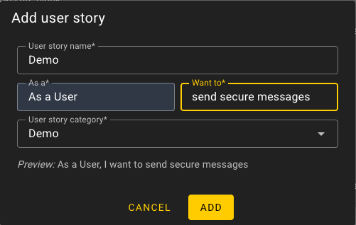
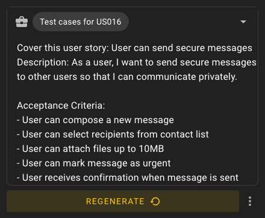
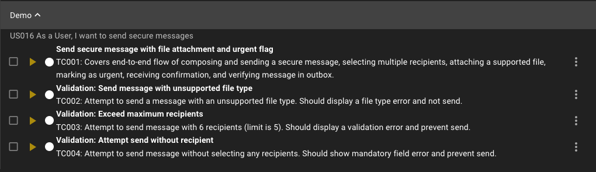

# Analysis - Inputs

First go to strategy for test analysis is to use our AI Testing Agent to analyze the application and generate test cases. Apart from crawling, you can also use Jira stories, Figma designs, or any other artifact to generate test cases. Actually, this is a more efficient way to generate test cases, because the AI Testing Agent can use only information from your crawling instruction / prompt and context from collected screenshots and HTML.

## Input Types which will improve quality of your test analysis

### 1. Jira Stories

- **User Stories** - Business requirements and acceptance criteria
- **Bug Reports** - Defect descriptions and reproduction steps
- **Feature Requests** - New functionality specifications
- **Epics** - High-level feature groupings

### 2. Figma Designs

- **UI Mockups** - Visual design specifications
- **Prototypes** - Interactive design flows
- **Design Systems** - Component libraries and patterns
- **Wireframes** - Low-fidelity layout concepts

### 3. Draft Test Cases

- **Manual Test Scripts** - Existing test documentation
- **Test Plans** - Testing strategy documents
- **Bug Reports** - Known issues and edge cases
- **Requirements Documents** - Business specifications

## Examples

### Jira Story Example

**Example Jira Story**:

```
Title: User can send secure messages
Description: As a user, I want to send secure messages to other users so that I can communicate privately.

Acceptance Criteria:
- User can compose a new message
- User can select recipients from contact list
- User can attach files up to 10MB
- User can mark message as urgent
- User receives confirmation when message is sent
- User can view sent message in outbox

Technical Notes:
- Messages are encrypted end-to-end
- File upload supports: PDF, DOC, JPG, PNG
- Maximum 5 recipients per message
```

Step 1: Add an user story:



Step 2: Prompt for user story:



Step 3: Test case generated:



### Figma Frame Example

**Upload Requirements**:

- **Format**: Export your Figma frame as PNG, JPG
- **Context**: Include relevant UI states (empty, filled, error)
- **Instructions**: Add all important information for complex interactions into instructions.

### Draft Test Case Example

**Example Test Case Example**:

```
Test Case: TC-001 - User can compose a new message
Preconditions: User is logged in
Steps:
1. Navigate to Messages page
2. Click "Compose" button
3. Fill recipient field with "recipient@example.com"
4. Enter subject line
5. Type message body
6. Click "Send" button
7. Verify message is sent successfully
Expected Result: Message is sent successfully and is visible in outbox
```

## Artifact Mapping Table

| Artifact Type        | What Wopee Extracts                                       | Affects User Stories        | Affects Tests                  |
| -------------------- | --------------------------------------------------------- | --------------------------- | ------------------------------ |
| **Jira Story**       | Title, description, acceptance criteria, labels, priority | ✅ Creates/updates stories  | ✅ Generates test scenarios    |
| **Figma Design**     | UI elements, interactions, states, design tokens          | ✅ Adds visual context      | ✅ Creates visual tests        |
| **Draft Test Case**  | Steps, expected results, preconditions                    | ✅ Validates requirements   | ✅ Generates test code         |
| **Bug Report**       | Issue description, steps to reproduce                     | ✅ Creates regression tests | ✅ Generates negative tests    |
| **Requirements Doc** | Business rules, constraints, workflows                    | ✅ Creates user stories     | ✅ Generates integration tests |

## Best Practices

### ✅ Do

- **Provide context** - Add descriptions to all artifacts
- **Use consistent naming** - Standardize artifact IDs
- **Include multiple states** - Upload different UI states
- **Validate extracted data** - Review what Wopee.io extracts
- **Update artifacts** - Keep inputs current with application changes

### ❌ Don't

- **Upload outdated designs** - Ensure artifacts match current state
- **Skip validation** - Always review generated output
- **Ignore conflicts** - Resolve contradictions between sources
- **Forget versioning** - Track changes to artifacts over time
