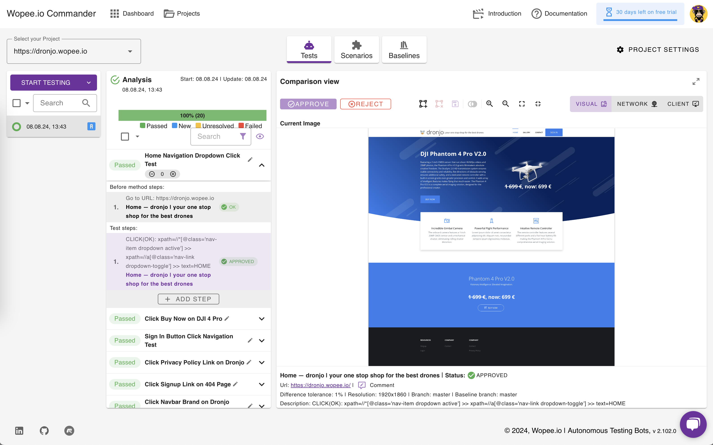

# 📙 Getting Started

## 1. Login to [Wopee Commander](https://cmd.wopee.io)

1. Go to [https://cmd.wopee.io](https://cmd.wopee.io).
2. Click on the `GitHub` or `GitLab` or `Google` login button.
3. Use your existing [GitHub](https://github.com/signup) or [GitLab](https://gitlab.com/users/sign_up) or [Google](https://accounts.google.com/) account and confirm the access.

## 2. Create a project

1. Click the `NEW PROJECT` button in the top right corner.
2. Enter the URL of your app.
3. Confirm by clicking `START ANALYSING`.

## 3. Run tests

1. After finishing the first analysis you`ll be presented with the results - generated test scenarios.
2. Then just click the `START TESTING` button.

This button can be disabled when some tests are curently running.

## 4. Check the results

1. Visual difference is highlighted if it was identified comapring current state (on the left) and the baseline - previously approved state (on the right).

## 5. Approve current state

You can **👍 Approve** or **👎 Reject** current state of the tested application if [Test Step Status](vocabulary.md#test-step-status) is:

- `New` - no previous state was approved (for this test step)
- `Unresolved` - previous state was already approved but current state is different (for this test step)
