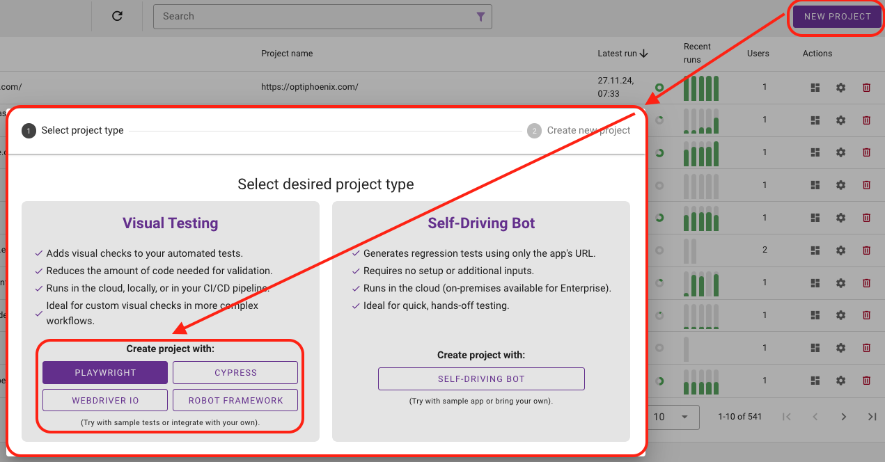
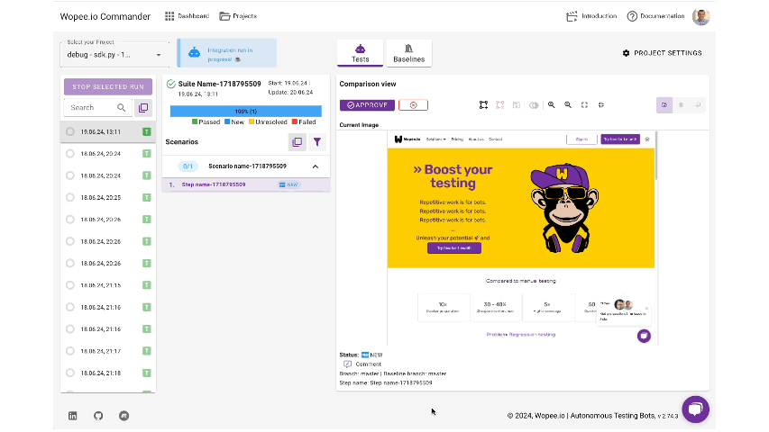

# Playwright

## 📄 About

Wopee.io integrates seamlessly with Playwright to enhance test coverage, expedite maintenance, and ensure more resilient test runs. With a vision of autonomous visual testing, Wopee.io enables easy visual validation integration into your existing Playwright tests, providing an extra layer of quality assurance.

Playwright is a modern, open-source test automation framework designed for JavaScript developers and QA engineers however it also provide bindings in multiple additional languages like Java, Python, or .NET.

Key features of Playwright include:

- **Cross-browser Testing**: Run tests across multiple browsers including Chromium, Firefox, and WebKit.
- **Automated Web Interactions**: Easily simulate user interactions for comprehensive testing.
- **Flexible and Powerful API**: Robust API for creating and managing tests.
- **Visual Comparisons**: Built-in support for capturing and comparing screenshots.
- **Efficient Execution**: Tests run in parallel for faster results.
- **Network Interception**: Full control over network traffic and requests.
- **Headless and Headed Modes**: Run tests in both headless and headed browser modes.

---

## 🚀 Quickstart

### 1. Get Sample project

- Navigate to [cmd.Wopee.io](https://cmd.wopee.io){: target="\_blank"} and click **`NEW INTEGRATION`** button **`Playwright`**.
  

- Fill in the project name and click **`CREATE`**.

- **Confirm an invitation** to GitHub private repository with sample tests. (Which you will recieve via email after project creation.)

### 2. Run Sample project

- Run those sample tests using `GitHub Actions` directly from the GitHub page of the sample repository.

!!! info "Detailed instructions are placed in README.md file inside the sample repository."

---

## 🧑‍💻 Integrate w. your tests

To start visual testing with **your existing Playwright tests**, leverage the benefits of the Wopee.io. Follow the steps below to install the plugin.

### 1. Install dependencies

**Prerequisites**

- Existing Playwright tests (if you need some, follow the [Quickstart](#quickstart) to get Sample project)

**Installation**

- Install `@wopee-io/wopee.pw` npm package into your existing Playwright project:

```shell
npm i -D @wopee-io/wopee.pw
```

**Environment setup**

- Set following environment variables:

```shell
WOPEE_PROJECT_UUID=your-project-uuid
WOPEE_API_KEY=your-api-key
```

??? tip "Where to find project UUID and API key in cmd.Wopee.io?"

    **Create a new Playwright project**

    - Navigate to [cmd.Wopee.io](https://cmd.wopee.io){: target="\_blank"} and click **`NEW INTEGRATION`** button **`Playwright`**.

      

    - Fill in the project name and click **`CREATE`**.

    **Find your project UUID and API key in the `PROJECT SETTINGS` / `API Keys` section.**

    

??? info "How to set env variables?"

    **Set API key via command**

    Before running the visual test, set up your API key as an environment variable named `WOPEE_API_KEY`.
    You may set it from the command line like this:

    === "Linux/MacOS"

        ```shell
        export WOPEE_API_KEY=your-api-key
        ```

    === "Windows"

        ```shell
        set WOPEE_API_KEY=your-api-key
        ```

    **Set project UUID via `.env` file**

    You need to set your own `.env` file to your project.

    This is a sample `.env` file:

    ```shell
    # Mandatory
    WOPEE_PROJECT_UUID=your-project-uuid
    ```

    Full list of `.env` file parameters could be found in our [playwright-template](https://github.com/Wopee-io/playwright-template){: target="\_blank"} / [.env.example](https://github.com/Wopee-io/playwright-template/blob/main/.env.example){: target="\_blank"}.

### 2. Modify your tests

**Start session**

- Add `wopee.startSuite()` into beforeAll or equivalent hook.
  ```typescript
  let wopee: Wopee;
  test.beforeAll(async () => {
    wopee = new Wopee();
    await wopee.startSuite("Minimal example");
  });
  ```

??? info "`wopee.startSuite()` function explained"
The `wopee.startSuite()` command initializes a session with the Wopee.io platform.

    This function might be called before any calls to `wopee.track...()`. Therefore, it is recommended to place it in the beforeAll hook or equivalent for your test suite.

**Test visually**

- Add `wopee.track...()` into individual tests wherever you need visual assertion.
  ```typescript
  await wopee.trackFullPage({ stepName: "exmplePageComparison" });
  ```

??? info "`wopee.tracktrackFullPage()`, `wopee.trackElement()` and `wopee.trackImage()` functions explained"
For automatic visual testing assertion, you can use one of the following functions. Which can capture and test _whole page_, _individual element_ or any _image_ you can provide.

    The `wopee.track...()` functions are used to capture screenshots and compare them with the baseline images stored in the Wopee.io platform.

    ```typescript
    await wopee.trackFullPage({stepName: 'exmplePageComparison'});
    ```

    ```typescript
    await wopee.trackElement({locator: element, stepName: 'exampleElementComparison'});
    ```

    ```typescript
    await wopee.trackImage({ imageBase64: imageBase64,, stepName: 'exampleImageComparison'});
    ```

**End scenario**

- Add `wopee.stopScenario()` into afterEach or equivalent hook.
  ```typescript
  test.afterEach(async () => {
    await wopee.stopScenario();
  });
  ```

??? info "`wopee.stopScenario()` function explained"
The `wopee.stopScenario()` command finalizes the current scenario which helps to keep your tests organized and separated. Plus you can see if your tests are currently running or not in the Wopee.io platform itself.

    This function must be called after all calls to `wopee.track...()` from the individual test in the afterEach hook or equivalent for your test suite.

### 3. Run tests as usual

You can run your tests as you would normally do - locally or using some CI/CD tool like GitHub Actions, GitLab CI, Jenkins, etc. The visual testing will be automatically triggered by the `wopee.track...()` functions placed in your tests.

The only condition is that Wopee.io platform is accessible from the environment where the tests are running.

## 📚 Examples

### Minimal test

To run sample test create a new file `tests/mini.spec.ts` and paste the following code:

```typescript
import { Wopee } from "@wopee-io/wopee.pw";
import { test } from "@playwright/test";

test.describe("test", () => {
  let wopee: Wopee;
  test.beforeAll(async () => {
    wopee = new Wopee();
    await wopee.startSuite("Minimal example");
  });

  test.afterEach(async () => {
    await wopee.stopScenario();
  });

  test("test", async ({ page }) => {
    await page.goto("https://playwright.dev/");

    const screenshot = await page.screenshot();
    const imageBase64 = screenshot.toString("base64");
    await wopee.trackImage({
      stepName: "image",
      scenarioName: "test",
      imageBase64: imageBase64,
    });
  });
});
```

### Complex test

To run sample test create a new file `tests/wopee.spec.ts` and paste the following code:

```typescript
import { Wopee } from "@wopee-io/wopee.pw";
import { test } from "@playwright/test";

test.describe("test", () => {
  let wopee: Wopee;
  test.beforeAll(async () => {
    wopee = new Wopee();

    const now = new Date();
    const date = `${now.getDate().toString().padStart(2, "0")}-${(
      now.getMonth() + 1
    )
      .toString()
      .padStart(2, "0")}-${now.getFullYear()}`;
    await wopee.startSuite(`test-${date}`);
  });

  test.afterEach(async () => {
    await wopee.stopScenario();
  });

  test("trackImage", async ({ page }) => {
    await page.goto("https://playwright.dev/");

    const screenshot = await page.screenshot({ type: "png" });
    const imageBase64 = screenshot.toString("base64");

    await wopee.trackImage({
      comment: "comment",
      customTags: "customTags",
      imageBase64: imageBase64,
      pixelToPixelDiffTolerance: 1.0,
      scenarioName: "trackImageWithoutStartScenario",
      stepName: "image-trackImage",
      viewport: "viewport",
    });
  });

  test("trackFullPageScreenshot", async ({ page }) => {
    await page.goto("https://playwright.dev/");

    await wopee.trackFullPage({
      comment: "comment",
      customTags: "customTags",
      page: page,
      pixelToPixelDiffTolerance: 1.0,
      scenarioName: "trackFullPageScreenshotWithoutStartScenario",
      stepName: "image-trackFullPageScreenshot",
      viewport: "viewport",
    });
  });

  test("trackElement", async ({ page }) => {
    await page.goto("https://playwright.dev/");

    const element = page.locator('//a[@class="getStarted_Sjon"]');

    await wopee.trackElement({
      comment: "comment",
      customTags: "customTags",
      locator: element,
      pixelToPixelDiffTolerance: 1.0,
      scenarioName: "trackElementWithoutStartScenario",
      stepName: "element",
      viewport: "viewport",
    });
  });

  test("trackViewport", async ({ page }) => {
    await page.goto("https://playwright.dev/");

    const element = page.locator('//a[@class="getStarted_Sjon"]');

    await wopee.trackElement({
      comment: "comment",
      customTags: "customTags",
      locator: element,
      pixelToPixelDiffTolerance: 1.0,
      scenarioName: "trackViewportWithoutStartScenario",
      stepName: "viewport",
      viewport: "viewport",
    });
  });
});
```

## 🏆 Benefits

... of Integrating Playwright with Wopee.io

**Basic Features:**

- **Advanced Visual Comparison**: Playwright's built-in visual comparison capabilities are enhanced by Wopee.io, providing a more comprehensive validation with pixel-perfect accuracy.
- **Ignore Areas**: Specify areas to ignore during comparisons by locator or coordinates, reducing false positives.
- **Baseline Management**: Efficiently handle baselines with bulk approval, filtering options, and the ability to flexibly tag baselines for better organization and control.
- **Cross-browser Screenshots**: Capture and compare screenshots across Chromium, Firefox, and WebKit for thorough cross-browser visual testing.

**Advanced Features:**

- **Baseline Version History**: Track changes over time with detailed version histories.
- **Multi-Branch and Multi-Config Support**: Easily manage tests across different branches and configurations.
- **Improved Team Collaboration**: Enhance teamwork with features designed for better collaboration and communication.
- **Archiving**: Keep your workspace organized with archiving capabilities for old or irrelevant tests.
- **Dynamic Content Handling**: Wopee.io provides tools to manage and compare dynamic content more effectively, reducing the noise in visual test results.

Additionally, users can **benefit from Wopee.io's visual testing bot**, which automates and streamlines the visual testing process, ensuring thorough and consistent validation without manual intervention.

Integrating Playwright with Wopee.io offers significant benefits for modern web application testing. Playwright provides a robust, efficient, and developer-friendly testing experience with advanced visual testing capabilities, while Wopee.io enhances this by adding comprehensive visual validation and management tools. This integration allows for advanced baseline management, enabling efficient handling of baselines with features like bulk approval, filtering, and flexible tagging. It also improves team collaboration with enhanced tools and supports thorough visual testing with automated comparison algorithms. Overall, combining Playwright with Wopee.io ensures more resilient test runs, faster maintenance, and higher quality web applications.

!!! tip "Playwright Visual Regression Testing with Wopee.io"

    Enhance your Playwright-based testing with Wopee.io's visual regression testing!

    Integrate seamlessly to catch visual bugs early and ensure your web app works flawlessly across versions. Set up in 1 minute, and start automating your regression tests to achieve faster feedback and consistent results.

    Start your Wopee.io for Playwright integration – [Free Trial](https://cmd.wopee.io), and streamline your visual regression testing with minimal maintenance.

    [Start Free Trial for Playwright](https://cmd.wopee.io)
