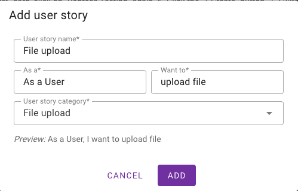
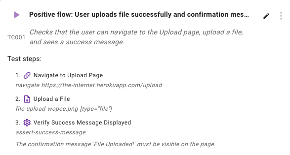

# 📁 Upload files

Upload files to your testing environment to ensure your tests can interact with file upload functionality in your web application.

## Overview

File uploads are a common feature in web applications. Wopee.io allows you to upload files that your tests can use during test execution, ensuring realistic testing scenarios for file upload workflows.

## Supported file types

There is no limit on the file types you can upload.

## How to upload files

Files used for testing should be stored in GitHub.

1. Upload files to the `data` directory in your GitHub repository.
2. Create new step manually, generate new test or modify existing test step in Commander UI.
3. Run the test.

### Creating tests with file uploads

You can create tests that use file uploads in several ways:

#### Method 1: Using AI prompt to generate new test

Create new user story and use prompt to generate test that uses file upload.



!!! tip "Use prompt"

    Create new user story and use prompt to generate test that use file upload.

    ```prompt
    Create test with following steps:

    - Navigate to `https://the-internet.herokuapp.com/upload`
    - Upload file `wopee.png`
    - Verify that the message `File Uploaded!` was displayed.
    ```

    

#### Method 2: Manual test creation

You can also create tests manually that include file upload steps:



1. Navigate to your project in [Wopee Commander](https://cmd.wopee.io): Project > Analysis > Test
2. Click "Add new user story" or "Add new test" for existing user story
3. Add steps that include file upload interactions
4. Reference your uploaded files by their filename or relative path.
5. Save and run the test.

## File management

### Organizing uploaded files

- Files are organized by project
- If you use files heavily consider using a folder structure in your `data` directory
- Files can be referenced in tests by their filename or relative path
- Maximum file size limit: 100MB per file (GitHub limit)

### File naming conventions

For better organization:

- Use descriptive names: `sample-document.pdf` instead of `file1.pdf`
- Avoid special characters and spaces in filenames
- Use lowercase with hyphens: `test-image-large.jpg`
- Consider using folders: `data/images/product-photo.jpg`, `data/documents/sample.pdf`

### Folder structure example

```
your-repository/
├── data/
│   ├── images/
│   │   ├── wopee.png
│   │   ├── product-photo.jpg
│   │   └── user-avatar.png
│   ├── documents/
│   │   ├── sample.pdf
│   │   ├── test-invoice.pdf
│   │   └── user-manual.docx
│   └── archives/
│       ├── backup.zip
│       └── export-data.csv
```

## Using uploaded files in tests

### AI testing agent

When using AI testing agent, uploaded files are automatically detected and can be used for:

- Form submissions with file inputs
- Document processing workflows
- Image upload validation
- Multi-file upload scenarios

The AI agent will automatically:

- Locate file input fields on the page
- Select the appropriate file from your data directory
- Handle the upload process
- Verify upload completion

## Best practices

!!! tip "File upload best practices"

    - **Test with realistic files**: Use files similar to what your users would upload
    - **Vary file sizes**: Test with small and large files to ensure proper handling
    - **Test different formats**: Upload various file types to validate format restrictions
    - **Organize with folders**: Use a clear folder structure in your `data` directory
    - **Descriptive naming**: Use clear, descriptive filenames for easy identification
    - **Version control**: Keep test files in your repository for consistency across environments

## Common use cases

### E-commerce applications

- Product image uploads
- Customer document verification
- Bulk product catalog imports

### Content management systems

- Media file uploads
- Document publishing workflows
- User avatar uploads

### Business applications

- Report uploads
- Data import functionality
- Compliance document submissions

## File upload test scenarios

### Single file upload

```prompt
Test single file upload:
- Navigate to upload page
- Select file `test-document.pdf`
- Click upload button
- Verify success message appears
```

### Multiple file upload

```prompt
Test multiple file upload:
- Navigate to multi-upload page
- Select files `image1.jpg`, `image2.png`, `document.pdf`
- Upload all files
- Verify all files appear in upload list
```

### File format validation

```prompt
Test file format restrictions:
- Try uploading unsupported file type `script.exe`
- Verify error message about invalid format
- Upload supported file `image.jpg`
- Verify successful upload
```

## Troubleshooting

### Upload fails

- Check file size (must be ≤ 100MB for GitHub)
- Verify file exists in your repository's `data` directory
- Ensure file path is correct (case-sensitive)

### File not found in tests

- Verify file was committed to your GitHub repository
- Check file path reference in test (relative to `data` directory)
- Ensure file name matches exactly (case-sensitive)

### Performance issues

- Large files may take longer to upload during tests
- Consider using smaller test files for faster execution
- Monitor GitHub repository size limits

!!! note "Need help?"

    If you encounter issues with file uploads, contact our support team at [help@wopee.io](mailto:help@wopee.io) or visit our [community discussions](https://github.com/orgs/Wopee-io/discussions).
